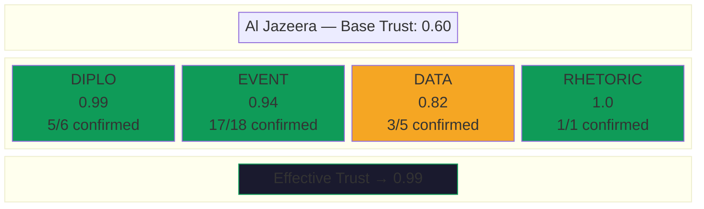
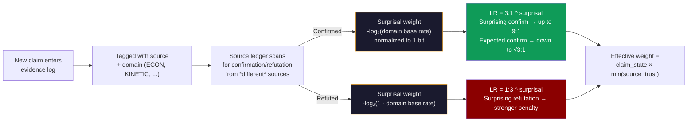

# Mathematical Appendix

> This is the mathematical appendix to the main [README](README.md). It covers the Bayesian inference, information-theoretic, and source trust mechanics that power the NROL-αΩ engine.

## Bayesian & Information-Theoretic Mechanics

The engine implements several formal mechanisms from Bayesian inference and information theory. These aren't decorative — they're load-bearing parts of the update pipeline that control how evidence flows into posteriors.

### Posterior Updates via Bayes' Theorem

`bayesian_update()` computes posteriors mechanically:

$$P(H_i|E) = \frac{P(E|H_i) \cdot P(H_i)}{\sum_j P(E|H_j) \cdot P(H_j)}$$

The operator supplies likelihoods P(E|H_i) for each hypothesis — "how probable is this evidence if H_i is true?" — and the engine handles the rest. Both raw and adjusted likelihoods are recorded in `posteriorHistory` for full auditability.

### Evidence Weight Attenuation (Mixture Model)

Evidence quality feeds into the Bayes computation through a proper probabilistic mixture model. Each piece of cited evidence has an `effectiveWeight` *w* representing the probability that the evidence is genuine signal rather than noise:

$$P(E|H_i) = w \cdot P(E|H_i,\text{real}) + (1-w) \cdot P(E|\text{noise})$$

where P(E|noise) = mean of raw likelihoods across all hypotheses (uninformative — identical for all H, so the noise component produces zero posterior movement after normalization). At *w*=1.0, the full likelihood passes through. At *w*=0, all hypotheses receive the same likelihood and posteriors don't move. At intermediate weights, the update is attenuated proportionally. Unlike a linear interpolation toward a fixed neutral value, this formulation is coherent: it corresponds to a well-defined generative model ("the evidence is real with probability *w*, noise otherwise") and preserves the direction of all likelihood ratios at every weight level.

`effectiveWeight` itself is the product of two factors:
- **Claim state weight**: PROPOSED (0.5) → SUPPORTED (1.0) → CONTESTED (0.2) → INVALIDATED (0.0)
- **Source trust**: Bayesian-updated per source per domain, starting from base priors and refined by claim resolution history with surprisal weighting

### Inverse Bayes: Likelihoods from Indicators

`suggest_likelihoods()` reverses the Bayes computation. Given indicator-defined posterior shifts (e.g. "H3 +15pp"), it derives the likelihoods that would produce those shifts:

$$L(H_i) \propto \frac{P_{\text{target}}(H_i)}{P_{\text{current}}(H_i)}$$

For indicators referencing sub-model scenarios (e.g. "Kharg +10pp"), the function resolves through the topic's conditional probability tables — `P(H_i | \text{scenario})` — to translate sub-model movements into hypothesis-level likelihood ratios.

### KL Divergence — Two Applications

**Prior-domination detection** (`compute_kl_from_prior`): Measures D_KL(current posterior ‖ initial prior). Low entropy + low KL = the model is confident but hasn't moved far from where it started — a sign that confidence is inherited from the prior rather than earned from evidence. The governance system flags this as `PRIOR_DOMINATED`.

**Operator-vs-mechanical divergence** (inside `bayesian_update`): When the operator supplies both likelihoods and their intuitive posteriors, the engine computes D_KL(mechanical ‖ intuitive). Divergence > 0.05 nats triggers a governance note. The mechanical result always wins, but the divergence is logged — making the gap between "what the math says" and "what the operator expected" visible and auditable.

### Shannon Entropy and R_t

The posterior distribution's Shannon entropy H = −Σ p_i log₂(p_i) drives several mechanisms:

- **Uncertainty ratio** (H / H_max): 1.0 = uniform (maximum ignorance), 0.0 = all mass on one hypothesis. Governance flags both extremes — near-maximum means the model isn't discriminating, near-zero means check for overconfidence.
- **R_t (evidence staleness risk)**: An entropy-weighted operational heuristic, not a pure information-theoretic derivation. For each hypothesis, R_t = (entropy contribution × time decay) / evidence recency. The entropy term ensures low-probability tail hypotheses with high surprise value get flagged when stale — a 5% hypothesis that hasn't been checked carries more surprise value if true than a 50% hypothesis. But R_t doesn't model the domain's actual volatility; it uses log-scaled time decay as a proxy. A fast-moving conflict and a slow-moving geological process get the same staleness curve unless the operator tunes `rtConfig` thresholds. This is a practical attention-allocation heuristic that uses entropy as a component, not a statement about information-theoretic optimality.
- **VoI query prioritization**: When entropy is high, the system prioritizes discriminating queries (which hypothesis is right?). When entropy is low, it prioritizes disconfirmation queries (is the leading hypothesis actually wrong?). Unfired high-tier indicators always rank highest.

### Brier Score Calibration

Every posterior update triggers a prediction snapshot. When a topic resolves, `record_outcome()` scores all historical snapshots against ground truth using the Brier score:

$$BS = \frac{1}{N} \sum_{i=1}^{N} (p_i - o_i)^2$$

where *o_i* = 1 for the correct hypothesis, 0 otherwise. Brier scores feed back into governance health — `POORLY_CALIBRATED` (Brier > 0.4) degrades system health. Hypotheses that expire by time (day count exceeds 1.5× the midpoint) get partial Brier scoring without waiting for full topic resolution.

### Bayesian Source Trust with Surprisal Weighting

Source trust isn't a static lookup table. The source ledger tracks claim outcomes per source per domain tag (ECON, KINETIC, DIPLO, etc.) and updates trust via Bayesian likelihood ratios — weighted by how surprising the resolved claim was.

Base LRs (cross-topic): confirmed → LR 3:1, refuted → LR 1:3. Per-topic: confirmed → LR 1.2, refuted → LR 0.7. These are then exponentiated by a surprisal weight:

$$LR_{\text{eff}} = LR_{\text{base}}^{s}, \quad s = \text{clamp}\left(\frac{-\log_2(p_{\text{domain}})}{1\text{ bit}},\ 0.5,\ 2.0\right)$$

where *p*_domain is the confirmation base rate for this domain tag. A source that correctly called something surprising (low base rate of confirmation in that domain) earns up to 2× the trust credit. A source that confirmed the obvious (high base rate) earns as little as 0.5×. This prevents "oil goes up during a war" from earning the same trust boost as "Iran releases hostages by Tuesday." The normalizer of 1 bit means a coin-flip base rate (p=0.5) produces weight 1.0 — the unsurprised default.

Surprisal weighting requires a minimum of 3 resolved claims per domain before it activates. With fewer, the base rate estimate is too noisy and the weighting would amplify noise rather than signal — so the system falls back to unweighted LRs until enough data accumulates.

Trust is stored and queried at four levels of specificity (first match wins): per-topic calibration → cross-topic domain trust → cross-topic overall trust → static base prior. The minimum trust across all cited sources is used (conservative).

## Source Trust: How It Updates

Sources don't have a single trust score. Trust is tracked **per domain** — a source that's excellent at reporting economic data might be unreliable on diplomatic analysis.

The update mechanism is Bayesian with surprisal weighting:

A source confirmed 5 times in ECON and refuted 3 times in RHETORIC will have high ECON trust and low RHETORIC trust. When that source makes a new ECON claim, it gets high weight. When it makes a RHETORIC claim, it gets low weight. The system learns this automatically from the evidence log. Crucially, the five ECON confirmations don't all count equally — if the domain base rate is 99% (ECON claims are almost always confirmed), each confirmation earns minimal trust credit. A single correct call in a domain where sources are usually wrong is worth more than five correct calls where everyone is right.

**Key finding from testing against live data**: domain predicts reliability far better than source identity (r=0.159 for source alone). ECON claims are 99.4% reliable across all sources; RHETORIC claims are 0% reliable.
