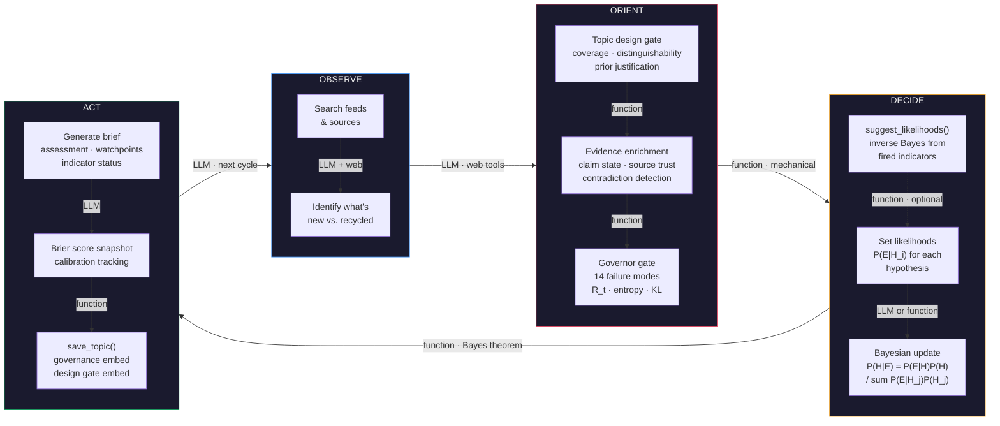

<p align="center">
  
  <br/>
  <sub>Simplified vector files available (AI/SVG). Patch art inspired by <a href="https://github.com/vgel">@vgel</a>.</sub>
</p>

# NROL-αΩ

**Necro Rationalist Operations Laboratory-αΩ** — A personal epistemic operating system.

Governor-gated Bayesian estimation engine that scaffolds the human-LLM pair so neither can degrade the other's reasoning. The human brings judgment. The LLM brings perception, tool use, and knowledge retrieval. The governor prevents both from updating on vibes, recycling stale evidence, or mistaking repetition for confirmation.

Not a forecasting tool. A framework for navigating uncertainty across every domain that matters to your life — geopolitics, economics, AI, climate, finance — with tracked beliefs, auditable reasoning, and calibration feedback that tells you where you're actually wrong.

## Why This Exists

You want to understand what's happening in the world without becoming a full-time forecaster. You want to drop a headline into a system and know whether it matters, how much, and to what. You want a record of how your beliefs actually evolved, not how you remember them evolving. And you want the LLM helping you to be structurally prevented from doing what LLMs do worst: confidently agreeing with whatever you already believe.

The system solves a specific problem: **an LLM without guardrails will sycophantically mirror your priors, and a human without structure will drift without noticing.** The governor breaks both failure modes by making every update pass through mechanical checks — cite your evidence, pass the hallucination checklist, survive the pre-commit gate, or get blocked. The LLM doesn't get to update on vibes. Neither do you.

Common failure modes this makes structurally harder:

1. **Anchoring**: you pick a number and then find evidence to support it
2. **Source laundering**: a rumor gets repeated across outlets and starts looking like consensus
3. **Rhetoric-as-evidence**: a politician's threat gets treated like an observed event
4. **Stale priors**: yesterday's assessment gets copy-pasted as today's with no new information
5. **Confirmation bias**: counterevidence gets lower weight because it's inconvenient
6. **Sycophantic convergence**: the LLM agrees with you, you feel validated, both walk away more confident and no more accurate

Every mutation — adding evidence, shifting posteriors, updating sub-models — passes through governance checks. The system tracks its own calibration (Brier scores), detects contradictions in the evidence log, and maintains domain-specific trust ratings for sources based on their empirical track record.

The goal isn't to be right. The goal is to *know how wrong you are* and get less wrong over time.

## How You Use It

### Daily (2 minutes): Triage

Drop a headline into the triage function. The system checks it against pre-registered indicators, watchpoints, and domain keywords across all active topics and tells you:

- **INDICATOR_MATCH → UPDATE_CYCLE**: This fires a pre-registered indicator. You already committed to what this means for your posteriors at topic design time. Run the update.
- **TOPIC_RELEVANT → MONITOR/REVIEW**: This touches a topic but doesn't match a specific indicator. Log it as evidence if substantive. If the same kind of event keeps showing up with no indicator match, you need a new indicator — the system's gap is now visible.
- **IRRELEVANT → IGNORE**: Doesn't touch any active topic. Move on.

The triage layer draws on SOC alert triage architecture from cybersecurity — matching incoming signals against pre-registered indicators of compromise. Nobody has applied this pattern to personal epistemic use before. It includes a third output mode (TOPIC_RELEVANT) that addresses the flexibility critique from [Millidge (2024)](https://www.beren.io/2024-05-05-Does-Scaffolding-Help-Humans/): the system doesn't only see what it pre-registered. It also flags novel events that touch a topic's domain without matching a specific indicator.

```python
from engine import triage_headline
r = triage_headline("CENTCOM announces new phase of operations in Persian Gulf", "CENTCOM")
# → INDICATOR_MATCH on hormuz-closure, fires 'new_phase' (tier1_critical)
# → Pre-committed effect: H3/H4 +15-25pp
# → Source trust: 95% (high)
# → Action: UPDATE_CYCLE
```

### Weekly (30 minutes): Update cycle

Pick the topic with the worst R_t (evidence staleness score). Run a full governed update — intel search, evidence ingestion, indicator check, posterior update or hold, brief generation. The governor enforces the full OODA loop: search for genuinely new information, validate before ingesting, cite evidence for every shift, and pass the 14-point hallucination checklist before posteriors move.

### Ongoing: The Mirror

The mirror dashboard (`/mirror`) is the longitudinal surface — how your beliefs have actually evolved, not how you remember them evolving:

- **Cross-topic overview**: all topics at a glance with posterior bars, governance health, R_t regime, last updated
- **Drift alerts**: stale evidence, stale cross-topic dependencies, R_t in DANGEROUS/RUNAWAY
- **Posterior trajectories**: time-series charts of how each hypothesis has moved over weeks and months
- **Dependency graph**: which topics feed into which, with stale edges highlighted

This is the product nobody else has. Metaculus tracks point estimates. Prediction markets track prices. This system tracks the full trajectory with governance metadata, evidence provenance, source trust histories, and calibration feedback attached.

### Cross-Topic Dependencies

Topics are not independent. "Will there be a recession?" and "Where will the Fed rate be?" are correlated through shared evidence and shared causal structure. The dependency system lets you declare these relationships:

```json
{
  "dependencies": {
    "upstream": [{
      "slug": "calibration-us-recession-2026",
      "assumptions": {"H1": 0.55, "H3": 0.15},
      "tolerance": 0.08
    }]
  }
}
```

When the upstream topic's posteriors drift beyond the assumed values, the downstream topic's governance health degrades and the mirror shows a stale dependency alert. The operator reviews whether the assumption still holds. This is alert-based, not auto-propagation — the math for Bayesian forecast reconciliation exists ([Athanasopoulos et al., 2024](https://robjhyndman.com/papers/hf_review.pdf)), but the operator decides whether to act.

### Loom Integration

The system is designed to be operated through [A Shadow Loom](https://github.com/lastnpcalex/a-shadow-loom) — a tree-branching conversation interface where every chat is a directed graph, not a linear thread. The mirror dashboard embeds in the loom as a persistent canvas panel. When you see a drift alert or a triage result that needs investigation, you branch into a conversation with Claude Code that has the full NROL engine loaded.

The `loom/` directory contains a standalone canvas deployment — copy it into your Claude Code project's `canvas/` folder. The canvas renders the dashboard and mirror views in-browser, and uses the Canvas SDK (`Loom.send()`) to send triage results, URLs, and social media posts directly to Claude for full pipeline processing. No `server.py` required.

The pipeline is governor-enforced end-to-end: paste a URL → Claude fetches content → triages against active topics → looks up source trust via the 5-tier calibration chain → logs evidence → updates posteriors → calibrates source trust → writes an activity log entry. The canvas auto-refreshes. See [`LOOM.md`](LOOM.md) for architecture details, setup instructions, and the trigger template system.

The tree structure maps to analytical branching: explore “what if we fire this indicator” on one branch and “what if we hold” on another. Each branch preserves the reasoning. The topic's posteriorHistory is linear, but the loom captures the *deliberation* that produced it — the part no other system preserves.

The mirror is the read surface (what does the system know). The loom is the write surface (what should we do about it).

### Epistemic Limitations

This engine is honest about what it is and what it isn't.

**What it is**: a Bayesian estimation engine where the update mechanics are principled and the governance layer enforces epistemic discipline. Posteriors are computed via Bayes' theorem from explicit likelihoods. Evidence weight feeds back into the update via a probabilistic mixture model — contested evidence is treated as a mixture of signal and noise, not discarded or blindly trusted. Source trust is Bayesian-updated per domain with surprisal-weighted likelihood ratios, so a source correctly predicting something surprising earns more trust than one confirming the obvious. Calibration is tracked via Brier scores and fed back into governance health.

**What it isn't**: a parametric generative model with closed-form likelihood functions. You can't call `P(evidence | H3)` and get a number from a distribution. But the system does contain a **distributed qualitative generative model** — the topic state file encodes a structured causal story about how the world produces evidence under each hypothesis:

- **Conditional probability tables** in sub-models: `P(H_i | scenario)` is specified explicitly (e.g. `khargConditionalHormuz: {H1: 0.0, H2: 0.05, H3: 0.35, H4: 0.6}`)
- **Indicators as likelihood proxies**: each indicator's `posteriorEffect` encodes which observables are more probable under which hypotheses — a tier-1 indicator with "H3/H4 surge" is implicitly saying P(indicator fires | H3) >> P(indicator fires | H1)
- **Actor decision models**: decision styles, biases, filters, and overrides model how key actors *generate* the evidence you observe. Trump's fixation-driven decision style predicts different observables than institutional rationality.
- **Tag direction hints**: KINETIC → H3/H4, DIPLO → H1/H2 encode which evidence types are more probable under which hypotheses

`suggest_likelihoods()` mechanizes part of this model — converting indicator effects and sub-model conditionals into explicit likelihood ratios via inverse Bayes. The actor models and tag hints are currently used by the LLM operator implicitly when supplying likelihoods; they're structured context, not yet code.

The human judgment lives in the topic design: defining hypotheses, setting indicator thresholds, specifying actor models, writing conditional tables. Everything downstream — the likelihood derivation, the Bayesian update, the evidence weighting, the governance checks — is mechanical.

#### The LLM-as-operator architecture

The system is designed to be operated by a language model — not as a novelty, but because the hardest part of intelligence analysis (translating unstructured reports into structured likelihood judgments) is exactly what LLMs do well, and the hardest failure mode of LLMs (confident hallucination with no self-awareness) is exactly what the governor was built to catch.

The architecture splits the problem:
- **The LLM** handles perception: reading news, identifying what's new vs. recycled, assessing source quality, mapping observations to hypotheses. This is where human-like judgment lives.
- **The engine** handles inference: Bayes' theorem, mixture model attenuation, entropy computation, Brier scoring. No judgment calls — pure math on whatever the operator feeds it.
- **The governor** handles discipline: rhetoric detection, hallucination checklists, evidence freshness scoring, admissibility gates. It exists because LLMs will confidently update posteriors on vibes if you let them. The governor doesn't let them.

TTLs are the critical mechanism here. Every evidence tag has a time-to-live — OSINT decays in 24 hours, commodity prices in 8 hours, diplomatic signals in 48 hours. When evidence ages past its TTL, governance health degrades. This isn't a suggestion; it's a forcing function that makes the operator go *search for new information* rather than recycling stale context. An LLM without TTL pressure will happily re-summarize last week's brief and call it an update. The TTL makes that behavior visible in the health score.

The hallucination checklist (`governor.hallucination_check()`) runs before every posterior update: Are you citing evidence that actually exists in the log? Is the evidence recent enough? Are you double-counting same-chain entries? Did you actually search, or are you pattern-matching from training data? These are exactly the failure modes that emerge when an LLM operates a forecasting system without guardrails.

This is not "AI-assisted analysis." It's a mechanical Bayesian system that uses an LLM as its sensory organ and a governor as its immune system.

#### Fundamental constraint: conditional dependence between evidence

This is the system's single biggest theoretical weakness, and it's not fully solvable without a joint distribution over sources — which no one has for geopolitical intelligence.

Intelligence sources are correlated in ways that are often opaque and dynamic. A Reuters correspondent in Dubai and an AP correspondent in Dubai might be independently reporting, or they might both be working off the same CENTCOM background briefing. Two "independent" confirmations that trace to the same satellite imagery are one data point, not two. When the system counts them as independent corroboration, it inflates confidence.

The engine provides **information-chain tracking** (`informationChain` field on evidence entries) so operators can declare when entries trace to the same primary source — the governor will not count same-chain entries as independent corroboration. But this only handles *known* dependencies. Most source correlations are invisible: shared briefings, shared imagery access, shared wire service feeds, herd behavior among analysts.

A proper Bayesian treatment would model the full joint distribution over sources. This engine does not attempt that. It takes the pragmatic position: make dependencies *declarable* when known, discount same-chain evidence automatically, and accept that undeclared dependencies will occasionally inflate confidence. The Brier score feedback loop is the long-run corrective — if correlated evidence is systematically overcounted, calibration will degrade and the operator will see it. But Brier scores aggregate over all sources simultaneously; they can't isolate *which* correlations are causing miscalibration. The operator still has to diagnose that.

This is an honest limitation, not a planned feature. If you have ideas for tractable approaches to source-correlation modeling in sparse-evidence domains, we'd like to hear them.

## The Loop

The system's update cycle maps to Boyd's OODA loop, but the key insight is *where judgment lives vs. where mechanism lives*. Human and LLM judgment are confined to perception (what happened?) and topic design (what matters?). Everything downstream — the Bayesian math, the governance checks, the calibration scoring — is mechanical. The governor exists to enforce that boundary.



**Where judgment lives:**

| Phase | Who | What they do |
|-------|-----|-------------|
| **Observe** | LLM + web tools | Search for news, read sources, determine what's new vs. recycled. This is perception — the hardest part to mechanize and where LLMs earn their keep. |
| **Orient** | Function (mechanical) | Design gate, evidence enrichment, governor checks. Zero judgment — structural validation, claim-state assignment, contradiction detection, source trust lookup. |
| **Decide** | LLM sets likelihoods *or* function derives them from indicators | The operator says "how likely is this evidence if H3 is true?" — that's the judgment call. Or `suggest_likelihoods()` derives it mechanically from pre-committed indicator definitions. Either way, Bayes' theorem does the math. |
| **Act** | LLM writes brief, function scores | Brief synthesis is LLM work. Brier scoring, governance snapshots, design gate embedding are all mechanical. The brief is the deliverable; the scores are the accountability. |

The governor's role is to make the boundary between judgment and mechanism *enforceable*. An LLM without the governor will confidently update posteriors on vibes. The governor forces it to show its work — cite evidence, pass the hallucination checklist, survive the pre-commit gate — or get blocked.

## How It Works (Detailed Pipeline)


## Bayesian & Information-Theoretic Mechanics

The engine uses principled Bayesian inference throughout: posterior updates via Bayes' theorem with explicit likelihoods, evidence weight attenuation through a probabilistic mixture model (contested or low-trust evidence produces proportionally weaker updates), inverse Bayes for deriving likelihoods from pre-committed indicator effects, KL divergence for prior-domination detection and operator-vs-mechanical divergence tracking, Shannon entropy driving R_t staleness scoring and VoI query prioritization, and Brier score calibration with partial scoring for expired hypotheses.

Source trust is Bayesian-updated per source per domain with surprisal-weighted likelihood ratios — a source correctly predicting something surprising earns more trust than one confirming the obvious. Trust is queried through a 5-tier chain: per-topic calibration, cross-topic domain, cross-topic overall, static base prior, 0.50 fallback.

For the full mathematical treatment including formulas, mixture model derivation, and source trust update diagrams, see **[MATH.md](MATH.md)**.

## Architecture

```
engine.py                  Topic I/O, add_evidence, update_posteriors, bayesian_update, suggest_likelihoods, save_topic
governor.py                Epistemic governor — 14 failure modes, R_t, entropy, KL from prior, claim lifecycle
server.py                  Multi-topic HTTP dashboard (port 8098)
AGENTS.md                  Standing orders for any AI assistant (Claude, Gemini, Cursor, etc.)
GEMINI.md                  gemini-cli integration — @file.md imports for all skills
LOOM.md                    Loom canvas architecture documentation

framework/
├── triage.py              SOC-style news triage — match headlines against indicators, watchpoints, keywords
├── dependencies.py        Cross-topic dependency graph — staleness detection, propagation alerts
├── update.py              Programmatic update pipeline (routine/crisis modes)
├── red_team.py            Devil's advocate — counterevidence scoring, contrarian analysis
├── contradictions.py      Multi-type contradiction detection with severity tiers
├── scoring.py             Brier score calibration, hypothesis expiry, partial scoring
├── source_ledger.py       Claim resolution tracking, Bayesian source trust updates
├── source_db.py           Cross-topic, domain-aware source performance database
├── backfill.py            Historical backfill + outcome-based source scoring
├── compaction.py          Evidence log compaction (preserves key claims + weights)
├── calibrate.py           Base source trust scores, verification functions
├── topic_design_gate.py   Pre-governor design gate — coverage matrix, distinguishability, prior justification + adversarial prompt
├── runner.py              CLI orchestrator
├── lint.py                Evidence log linting (failure mode checks)
├── migrate_to_lr.py       Migrate legacy posteriorEffect pp shifts to likelihood-ratio form
├── replay_indicators.py   Replay historical indicator fires under LR semantics for backtest
├── stamp_deadlines.py     Stamp/normalize indicator and prediction deadlines across topics
├── stamp_resolution_dates.py  Stamp resolution dates on topics from meta + hypothesis midpoints
└── test.py                Hypothesis test registry

skills/                    AI assistant skill prompts (read by AGENTS.md, GEMINI.md, Claude Code commands)
├── triage.md              Process new information — match, assess source, route action
├── update-cycle.md        Fire indicator + update posteriors with full governor gate
├── evidence.md            Add evidence with provenance, lint, and claim lifecycle
├── governance.md          Epistemic health audit — R_t, freshness, admissibility, entropy
├── topic-design.md        Create/modify topics with design gate checklist
├── dependencies.md        Wire and check cross-topic links, stale edge detection
├── source-trust.md        5-tier source trust chain, register and calibrate sources
├── red-team.md            Devil's advocate challenges, contrarian scoring
├── calibration.md         Record outcomes, Brier scoring, backfill pipeline
├── resolve.md             Prediction sweep — resolve expired predictions, calibrate sources
├── extrapolate.md         Agent pipeline for generating and vetting long-horizon predictions
├── extrapolation-tuning.md Tuning notes for the extrapolation pipeline (personas, sweeps, thresholds)
└── news-scan.md           Automated multi-topic news sweep

loom/                      Standalone canvas dashboards (runs inside A Shadow Loom iframe)
├── index.html             Per-topic dashboard — posteriors, indicators, evidence, governor health
├── mirror.html            Cross-topic mirror — triage engine, governor port, trust panel, activity feed
├── source-trust.json      Source trust display config for canvas
├── topics/                Topic JSONs + manifest for canvas reads
└── triggers/              Pipeline prompt templates (enforce 5-tier trust, rhetoric lint, mandatory branching)
    ├── pipeline.md        Standard headline/URL triage trigger (9-step, cold storage for IGNORE)
    ├── social-post.md     Platform-aware social media trigger (3-filter prediction gate)
    └── evidence-drop.md   File/screenshot drop processing trigger

mirror.html                Longitudinal dashboard — trajectories, drift alerts, dependency graph, triage input
topics/                    One JSON state file per active topic (gitignored; calibration-*.json tracked)
briefs/                    Generated intelligence briefs per topic (gitignored)
sources/                   Source database (cross-topic trust tracking)
```

### AI Assistant Integration

The framework is designed to be operated by any AI assistant, not just one. Three layers of enforcement:

1. **`AGENTS.md`** — shared standing orders. Any agent operating the framework reads this file and follows 5 mandatory behaviors: triage before acting, governor checks on every update, full evidence provenance, dependency propagation, and source trust chain.
2. **`skills/`** — 10 skill prompts that map to the Python framework's actual function calls. Each skill file contains the constraints, field schemas, and lint rules for one workflow.
3. **Slash commands** (`.claude/commands/`) — project-scoped one-keystroke commands (`/triage`, `/update`, `/evidence`, `/governance`, `/lint`, `/dependencies`, `/resolve`) that enforce the skill system mechanically in Claude Code.

For **gemini-cli**, `GEMINI.md` uses `@file.md` imports to load all skills into context automatically.

### Key Invariant

**Every mutation goes through the governor.** Never write directly to `topic["evidenceLog"]`, `topic["model"]["hypotheses"]`, or `topic["subModels"]`. Always use `add_evidence()`, `update_posteriors()` / `bayesian_update()`, `update_submodel()`, `hold_posteriors()`. The governor enriches, validates, and gates every change.

**Every topic goes through the design gate.** Before a topic enters the governor's jurisdiction, it must pass `topic_design_gate.py` — a two-stage structural review that runs automatically on every `save_topic()` call:

1. **Mechanical checks** (`run_mechanical_checks()`) — instant, no LLM, no judgment calls. Catches:
   - Missing fields, empty indicator tiers, hypotheses without anti-indicators
   - Non-observable resolution criteria, degenerate hypothesis labels
   - **Coverage matrix**: builds a hypothesis × indicator map by parsing `posteriorEffect` strings with direction (positive/negative). Flags hypotheses with zero indicator coverage (permanently underdetermined) and coverage asymmetry (can only gain or only lose probability)
   - **Distinguishability analysis**: detects hypothesis pairs that share all indicators *and* are moved in the same direction — meaning no evidence can discriminate between them. Direction-aware: two hypotheses affected by the same indicator in opposite directions (H1 +10pp, H2 -5pp) are distinguishable even though they share the indicator
   - **Prior justification**: uniform priors warned as potential lazy defaults; non-uniform priors without a documented rationale in `posteriorHistory` are blocked
   - Indicator observability (flags subjective language like "believe", "seem", "likely")
2. **Adversarial review** (`generate_review_prompt()`) — produces a fixed prompt for an LLM subagent that acts as an adversarial examiner, not a collaborator. Eight checks covering edge cases the mechanical layer can't reach. The subagent must PASS or FAIL each check with specific objections.

The gate is wired into `engine.py` — results are embedded in `topic["governance"]["designGate"]` on every save, including the coverage matrix and indistinguishable pairs. A blocked topic triggers a warning but doesn't prevent saving (the operator needs to fix and re-save).

The governor gates every *update*. The design gate gates the *topic itself*. A bad topic design wastes months of tracking and corrupts the calibration corpus. The design gate catches structural flaws before that investment begins.

```bash
# Run the design gate
python framework/topic_design_gate.py topics/my-topic.json          # mechanical checks
python framework/topic_design_gate.py topics/my-topic.json --prompt  # + adversarial review prompt
```

Two paths for posterior updates:
- **`update_posteriors()`** — operator supplies final posteriors directly. The governor validates them against the hallucination checklist but the Bayesian math is implicit (in the operator's head).
- **`bayesian_update()`** — operator supplies explicit likelihoods `P(E|H_i)` and the engine computes posteriors mechanically via Bayes' theorem. Same governor gate, but the reasoning is auditable: likelihoods are recorded in `posteriorHistory`. Likelihoods are attenuated by the `effectiveWeight` of cited evidence — contested or low-trust evidence produces weaker updates automatically.
- **`suggest_likelihoods()`** — converts fired indicator `posteriorEffect` strings into likelihood ratios via inverse Bayes. Parses explicit pp shifts, qualitative directions (`H3/H4 surge`), and submodel references (resolved through conditional distributions). Returns a structured suggestion for operator review before passing to `bayesian_update()`.

## Setup

### Requirements

Python 3.10+. Zero external dependencies — stdlib only. No pip install, no venv, no requirements.txt.

### Installation

```bash
git clone https://github.com/lastnpcalex/nrol-alpha-omega.git
cd nrol-alpha-omega
```

### Loom Integration

The system is designed to be operated through [A Shadow Loom](https://github.com/lastnpcalex/a-shadow-loom) — a tree-branching conversation interface where the mirror dashboard embeds as a persistent canvas panel.

1. Create a conversation with `project_dir` pointed at this repo
2. Enable canvas in the conversation settings
3. Copy loom files into the canvas directory: `cp -r loom/* canvas/`
4. Copy topic files and source database: `cp topics/*.json canvas/topics/ && cp sources/source_db.json canvas/`
5. Pipeline intake auto-initializes on first canvas load — no server required
6. Use the **SCAN ALL** / **SCAN TOPIC** buttons in the mirror dashboard to run multi-topic news sweeps

The pipeline is governor-enforced end-to-end: paste a URL into the canvas triage input, Claude fetches content, triages against active topics, looks up source trust, logs evidence, updates posteriors, calibrates source trust, and writes an activity log entry. See [`LOOM.md`](LOOM.md) for architecture details and the trigger template system.

### Standalone (No Loom)

The framework works without Loom. Use the Python API directly or Claude Code slash commands (`/triage`, `/update`, `/evidence`, `/governance`, `/lint`, `/dependencies`, `/resolve`).

## Quickstart

The primary interface is the pipeline — triage headlines and process evidence programmatically:

```python
from engine import triage_headline, load_topic, add_evidence, save_topic
from framework.update import process_headline, process_evidence
import json

# Pipeline: triage a headline across all topics
r = triage_headline("CENTCOM announces new phase of operations in Persian Gulf", "CENTCOM")
print(json.dumps(r, indent=2))

# Pipeline: full headline processing (triage + evidence + update + save)
result = process_headline("Iran tests ballistic missile near Strait of Hormuz", source="Reuters")

# Pipeline: process pre-structured evidence into a topic
result = process_evidence("hormuz-closure", {
    "tag": "KINETIC", "source": "CENTCOM",
    "text": "US Navy intercepts drone near carrier group in Gulf of Oman"
})
```

CLI tools for inspection and management:

```bash
# List topics
python engine.py list

# Show topic state
python engine.py show hormuz-closure

# Run a governance report
python governor.py report hormuz-closure

# Run a full update cycle
python framework/runner.py update --topic hormuz-closure --mode routine

# Lint the evidence log
python framework/runner.py lint --topic hormuz-closure

# Run the red team
python -c "
from engine import load_topic
from framework.red_team import generate_red_team, format_red_team_challenge
topic = load_topic('hormuz-closure')
red = generate_red_team(topic, topic['model']['hypotheses'])
print(format_red_team_challenge(red))
"

# Check calibration
python framework/scoring.py hormuz-closure --report

# Ingest source data into the cross-topic database
python framework/source_db.py ingest --topic hormuz-closure

# Triage a headline
python -c "
from engine import triage_headline
import json
r = triage_headline('CENTCOM announces new phase of operations in Persian Gulf', 'CENTCOM')
print(json.dumps(r, indent=2))
"

# Check cross-topic dependencies
python -c "
from framework.dependencies import build_dependency_graph
import json
print(json.dumps(build_dependency_graph(), indent=2))
"

# Launch the dashboard
python server.py
```

## Dashboards

`python server.py` launches the server on port 8098 (binds `0.0.0.0` — accessible over Tailscale or LAN).

### Topic Dashboard (`/`)

The landing page is a card grid showing all tracked topics at a glance. Each card displays:

- Posterior distribution bar with color-coded hypothesis segments
- Classification badge (ROUTINE / ELEVATED / ALERT with pulsing animation)
- Governance health dot + R_t regime badge (computed client-side via governor port)
- Relative timestamp ("3h ago", "2d ago")

**Sort options** (default: most recently updated): Recently Updated, A-Z, Health, Classification, Uncertainty. Filter by status (Active / All / Resolved) and free-text search.

**Mobile-first responsive layout**: 1 column on phones, 2 on tablets, 3-4 on desktop. Sticky header, 44px+ touch targets.

Click any card to drill into the **topic detail view**, which renders:

- Posterior distribution bar + historical trajectory chart (canvas)
- Sub-models with scenarios, deadlines, and conditional probabilities
- Epistemic governor health (R_t regime, entropy, freshness, admissibility, issues)
- Indicator status across all tiers (with fired/pending states and pre-committed effects)
- Data feeds with baseline deltas
- Evidence log (latest 20, color-coded by tag with full provenance)
- Actor model and methodology rules
- Calibration score (Brier) for resolved topics with trajectory bars
- Key watchpoints
- Activity ticker (recent pipeline events)

Back button returns to the dashboard. Deep links via URL hash (`#hormuz-closure`). Auto-refreshes every 60 seconds.

### Mirror Dashboard (`/mirror`)

The longitudinal surface — how your beliefs have actually evolved across all topics:

- **Triage input**: drop a headline + source, get instant routing across all active topics (client-side indicator/watchpoint/keyword matching)
- **Cross-topic overview**: all topics at a glance with posterior bars, health badges, R_t regime, staleness — searchable and sortable
- **Source trust leaderboard**: all registered sources ranked by domain trust with visual meters and claim records
- **Drift alerts**: stale dependencies, DANGEROUS/RUNAWAY R_t, downstream propagation warnings
- **Posterior trajectories**: time-series charts per topic showing how each hypothesis moved
- **Dependency graph**: upstream/downstream edges with stale edge highlighting and drift magnitude

Auto-refreshes every 60 seconds.

### Loom Canvas (`loom/`)

Standalone version of both dashboards that runs inside [A Shadow Loom](https://github.com/lastnpcalex/a-shadow-loom)'s canvas iframe. No server required. Reads topic state from local JSON files and uses the Canvas SDK to send triage results directly to Claude for processing.

Additional features over the server dashboards:

- **URL pipeline**: paste a URL into the triage input, it's sent to Claude who fetches, triages, logs evidence, and updates posteriors automatically
- **Social media routing**: Twitter/X, Bluesky, Reddit, YouTube links are detected and routed through a platform-aware trigger with appropriate source trust handling and a 3-filter prediction gate (specific, testable, time-bounded)
- **Evidence drop zone**: drag files or screenshots onto the mirror page for processing
- **Source trust leaderboard**: searchable, sortable panel showing all registered sources with per-domain Bayesian trust scores, meter bars, and record counts
- **Topic search and sort**: filter topics by name, sort by Health/R_t/A-Z/Updated
- **Prediction tracking**: evidence entries with PREDICTION tags carry structured claims with resolution criteria and deadlines; the `/resolve` skill sweeps expired predictions and fires source calibration with minimum-sample guards
- **Cold storage**: IGNORE'd pipeline evidence is written to `evidence-cold.json` with full provenance (claims, domains, actors, regions, keywords) for retroactive matching when new topics are created
- **Activity feed**: real-time audit trail of all pipeline actions (evidence logged, posteriors shifted, sources calibrated, predictions resolved)
- **Mandatory loom branching**: all triggers create a loom branch before modifying files — no exceptions, regardless of invocation context
- **Governor-enforced triggers**: prompt templates in `loom/triggers/` that enforce the 5-tier trust chain, rhetoric-vs-evidence lint, claim lifecycle weights, and branch isolation

Setup: `cp -r loom/* canvas/` then copy topic files and `sources/source_db.json` into the canvas. See [`LOOM.md`](LOOM.md).

### API Endpoints

| Method | Path | Returns |
|--------|------|---------|
| GET | `/topics` | List of all topics (slug, title, status, classification) |
| GET | `/topics/{slug}/state.json` | Full topic state |
| GET | `/topics/{slug}/governance.json` | Live governance report |
| GET | `/overview` | Cross-topic overview (posteriors, health, R_t, staleness) |
| GET | `/trajectories` | Posterior history for all topics |
| GET | `/trajectories/{slug}` | Posterior history for one topic |
| GET | `/dependencies` | Full dependency graph (nodes, edges, stale edges) |
| POST | `/triage` | Triage a headline: `{"headline": "...", "source": "..."}` |

## Example: LK-99 Superconductor (Resolved)

The repo includes a historical reconstruction of the LK-99 room-temperature superconductor saga (July-August 2023) as a worked example of the full topic lifecycle.

**Question**: Is LK-99 a room-temperature, ambient-pressure superconductor?

**Hypotheses**:
- H1: Genuine RT superconductor (prior: 0.10)
- H2: Partial — real but not full SC (prior: 0.20)
- H3: Not SC — mundane explanation (prior: 0.50)
- H4: Fraud or severe methodological failure (prior: 0.20)

**Posterior evolution** over 25 days:

```
H3 ███████████████████████████████████████████████ 0.90  ← Cu2S impurity
H1 █                                               0.01
H2 █                                               0.02
H4 ████                                            0.07
```

**What the system caught**:
- Social media hype (RHETORIC tag) → zero posterior movement, correctly ignored
- Huazhong partial levitation video → H2 bump only, not H1 (partial signal ≠ Meissner)
- DFT flat bands (LBNL) → small H1/H2 boost (theoretical support, not proof)
- 6+ failed replications → bulk failure indicator fired, H3 surged
- Cu2S phase transition identified → smoking gun, H3 locked in

**Governance snapshot at resolution**:
- **KL from prior**: 0.39 nats → `MODERATE`. The prior already favored H3 (0.50), so reaching H3=0.90 was a significant move but not a reversal. Honest classification: the evidence confirmed a direction the prior already leaned, rather than overturning it.
- **R_t**: all hypotheses `SAFE` — evidence was fresh at time of resolution.
- **Health**: `DEGRADED` (post-resolution, all 15 evidence entries have aged past TTL — expected for a closed topic).

**How `bayesian_update()` would have worked** (retrospective):

The Aug 3 update (6+ failed replications) could have been expressed as explicit likelihoods:

```python
# If H3 is true (mundane), how likely are 6 failed replications? Very.
# If H1 is true (genuine SC), how likely are 6 failures? Very unlikely.
bayesian_update(topic, likelihoods={
    "H1": 0.05,   # P(6 failures | genuine SC) — almost impossible
    "H2": 0.30,   # P(6 failures | partial SC) — possible if effect is subtle
    "H3": 0.90,   # P(6 failures | not SC) — expected
    "H4": 0.60,   # P(6 failures | fraud) — expected but not certain
}, reason="6+ independent replication failures", evidence_refs=[...])
```

The engine computes posteriors mechanically via Bayes' theorem. If the cited evidence has low `effectiveWeight` (contested claims, low-trust sources), the likelihoods are attenuated via the mixture model — the evidence is treated as a probability-weighted mix of genuine signal and uninformative noise, so weak evidence produces proportionally weaker posterior shifts without distorting likelihood direction. If the operator also supplies their intuitive posteriors, the system logs the KL divergence between mechanical and intuitive results — making the gap between math and intuition visible.

**`suggest_likelihoods()`** — instead of hand-crafting likelihoods, derive them from pre-committed indicator definitions. Indicators are defined at topic creation before the evidence arrives — they're a pre-registered analysis plan, not a post-hoc rationalization. When an indicator fires, the function mechanizes what the operator already committed to:

```python
# Fire an indicator, then get suggested likelihoods
fire_indicator(topic, "t1_bulk_failure", note="6+ labs failed to replicate")
suggestion = suggest_likelihoods(topic, ["t1_bulk_failure"])
# suggestion["suggested_likelihoods"] = {"H1": 0.05, "H2": 0.30, "H3": 1.0, "H4": 0.60}
# suggestion["target_posteriors"] = {"H1": 0.01, "H2": 0.03, "H3": 0.93, "H4": 0.03}
# suggestion["ready"] = True

# Review, optionally adjust, then apply
bayesian_update(topic, suggestion["suggested_likelihoods"],
                reason="6+ replication failures", evidence_refs=[...])
```

For indicators with unparseable effects (e.g. "Thesis confirmation"), `ready` returns `False` and the operator can supply overrides via `override_effects={"indicator_id": {"H1": +5, "H3": -3}}`.

**Information chains** (retrospective): Multiple outlets reported the Huazhong levitation video. Without `informationChain` tracking, each article could have been counted as independent corroboration. With it:

```python
add_evidence(topic, {
    "tag": "EXPERIMENTAL", "source": "reuters",
    "text": "Huazhong University video shows partial levitation of LK-99 sample",
    "informationChain": "huazhong-levitation-video-2023-07",  # same primary source
})
add_evidence(topic, {
    "tag": "EXPERIMENTAL", "source": "scmp",
    "text": "Chinese university demonstrates LK-99 sample levitating",
    "informationChain": "huazhong-levitation-video-2023-07",  # same video, same chain
})
# Governor treats these as ONE evidential unit, not independent corroboration
```

**Source trust after outcome scoring** (carried into future science topics):

| Source | Domain Trust | Why |
|--------|-------------|-----|
| arXiv (Lee & Kim) | 0.25 | Made the wrong claim (20 years sunk cost) |
| Huazhong University | 0.10 | Viral video was ferromagnetic Cu2S, not Meissner |
| IBS Korea (single crystal) | 0.75 | Definitive negative result |
| University of Maryland | 0.75 | Identified the Cu2S mechanism |

If Huazhong publishes an EXPERIMENTAL claim on the next science topic, the governor starts them at 0.10 domain trust instead of 0.50. They have to earn it back.

To explore the LK-99 topic: `python engine.py show calibration-lk99-superconductor`

## Creating a New Topic

1. Copy `topics/_template.json` to `topics/{your-slug}.json`
2. Set `meta.topicType` to one of: `conflict`, `science`, `election`, `tech` (or leave empty for custom)
3. Fill in: question, resolution criterion, hypotheses (with midpoints), indicators, actor model
4. Wire up data feeds with baseline values
5. Choose relevant tags from the tag registry (see below) and list them in `tagConfig.availableTags`
6. Run `python engine.py show your-slug` to verify the governor accepts it
7. Start adding evidence — the system handles enrichment, claim states, and calibration automatically

## Evidence Tags

Tags classify evidence by domain. Each tag has a TTL (how fast it goes stale), a fact/decision classification, and optional direction hints for the red team's heuristic inference.

The system ships with **28 tags** across 6 categories. Pick the ones relevant to your topic:

| Category | Tags |
|----------|------|
| **Universal** | `EVENT` `DATA` `RHETORIC` `INTEL` `ANALYSIS` `OSINT` `POLICY` |
| **Conflict** | `KINETIC` `FORCE` `DIPLO` `SIGINT` |
| **Economic** | `ECON` `MARKET` |
| **Political** | `POLITICAL` `POLL` `LEGAL` `REGULATORY` `JUDICIAL` `LEGISLATIVE` |
| **Science** | `SCIENTIFIC` `EXPERIMENTAL` `TECHNICAL` |
| **Social** | `CORPORATE` `DEMOGRAPHIC` `SOCIAL` `ENVIRONMENTAL` `EDITORIAL` `FORECAST` |

### Topic Type Presets

Setting `meta.topicType` in your topic JSON automatically configures which tags the red team uses for direction inference:

| Topic Type | Example Use Cases | Key Tags | Direction Logic |
|-----------|-------------------|----------|----------------|
| `conflict` | Wars, crises, blockades | KINETIC, FORCE, DIPLO, ECON | Kinetic events argue for longer timelines; diplomacy argues shorter |
| `science` | LK-99, replication studies | EXPERIMENTAL, SCIENTIFIC, TECHNICAL | Lab results and papers push toward confirmation |
| `election` | Elections, referenda | POLL, POLITICAL, LEGAL | Neutral — direction from content, not tag |
| `tech` | AI capabilities, product launches | TECHNICAL, SCIENTIFIC, REGULATORY | Technical demos argue "sooner"; regulation argues "slower" |

### Custom Tag Configuration

For topics that don't fit a preset, configure `tagConfig` in the topic JSON:

```json
{
  "tagConfig": {
    "availableTags": ["EVENT", "DATA", "SCIENTIFIC", "EXPERIMENTAL", "RHETORIC"],
    "directionHints": {
      "EXPERIMENTAL": {"H1": 1, "H2": 1, "H3": -1},
      "SCIENTIFIC": {"H1": 1}
    },
    "escalationTags": ["EXPERIMENTAL"],
    "deescalationTags": ["RHETORIC"]
  }
}
```

## Epistemic Governance

The governor (`governor.py`) enforces analytical discipline through multiple mechanisms:

| Mechanism | What It Does |
|-----------|-------------|
| **R_t (info-theoretic)** | Evidence freshness scoring — entropy contribution × log-time decay / evidence recency → SAFE / ELASTIC / DANGEROUS / RUNAWAY |
| **14 Failure Modes** | Pre-commit checklist (3 CRITICAL, 5 HIGH, 3 MEDIUM, 3 LOW) |
| **Dual Ledger** | Facts (auto-decay) vs decisions (explicit supersession) |
| **Claim Lifecycle** | PROPOSED → SUPPORTED → CONTESTED → INVALIDATED |
| **Contradiction Detection** | DIRECT, FEED_MISMATCH, MAGNITUDE, TEMPORAL — with severity tiers |
| **Source Trust Weighting** | Evidence weight = claim_state × domain-specific source trust |
| **Prediction Detection** | Future-tense claims auto-downgraded to PROPOSED (0.5 weight) |
| **Rhetoric Guard** | RHETORIC-tagged evidence used to justify shifts triggers failure |
| **Hypothesis Expiry** | Auto-detects when dayCount exceeds hypothesis midpoint × 1.5 |
| **Brier Score Tracking** | Snapshot posteriors at each update; score against outcomes |
| **Entropy Monitoring** | Tracks posterior distribution spread for calibration health |
| **KL from Prior** | Detects prior-dominated confidence — sharp posteriors that never moved from the initial prior |
| **Information Chains** | Evidence entries sharing an `informationChain` ID are treated as one evidential unit, not independent corroboration |

### Hallucination Failure Modes (14 total)

| # | Mode | Severity | Trigger |
|---|------|----------|---------|
| 1 | no_evidence | CRITICAL | Posterior shift with no supporting evidence |
| 2 | circular_reasoning | CRITICAL | Evidence cites its own posterior as support |
| 3 | unresolved_contradiction | CRITICAL | HIGH-severity contradiction + shift > 0.02 |
| 4 | stale_evidence | HIGH | >50% of evidence older than R_t window |
| 5 | rhetoric_as_evidence | HIGH | RHETORIC tag used to justify shift |
| 6 | prediction_treated_as_fact | HIGH | Future-tense claim at OBSERVED weight |
| 7 | anchoring | HIGH | Shift too small given evidence weight |
| 8 | source_laundering | HIGH | Same claim from same source counted twice |
| 9 | magnitude_mismatch | MEDIUM | Shift size doesn't match evidence strength |
| 10 | missing_counterevidence | MEDIUM | No devil's advocate check before shift |
| 11 | unfalsifiable_hypothesis | MEDIUM | Hypothesis has no observable resolution |
| 12 | temporal_confusion | LOW | Evidence timestamp inconsistent with claim |
| 13 | feed_key_mismatch | LOW | Data feed reference doesn't match topic |
| 14 | duplicate_evidence | LOW | Semantic duplicate of existing entry |

## Calibration Roadmap

The engine's Bayesian mechanics are implemented and tested. What's missing is empirical validation that the operator is well-calibrated — that the likelihoods fed into `bayesian_update()` produce posteriors that track reality. Brier scoring infrastructure exists and the LK-99 backfill validates mechanics (average Brier 0.069), but real calibration requires prospective predictions scored honestly against outcomes.

Ten calibration topics have been designed spanning geopolitics, economics, domestic politics, conflict/trade, and physics, with horizons from 3 months to rolling windows. The goal is N >= 10 resolved prospective topics to derive empirical claim-state weight functions, replacing the current hand-set values (SUPPORTED=1.0, PROPOSED=0.5, CONTESTED=0.2, INVALIDATED=0.0).

For the full calibration plan including all 10 proposed topics, selection rationale, and phased timeline, see **[CALIBRATION.md](CALIBRATION.md)**.

## Acknowledgments

The epistemic governance layer builds on patterns from **[@unpingable](https://github.com/unpingable)**'s **[Agent Governor](https://github.com/unpingable/agent_governor)** framework:

- The **R_t control equation** concept for evidence freshness scoring (rewritten with information-theoretic grounding: entropy contribution × log-time decay)
- The **dual-ledger design** (facts vs decisions) for separating observations from analytical choices
- The **claim lifecycle** (PROPOSED → SUPPORTED → CONTESTED → INVALIDATED) for evidence state
- **Admissibility gating** for hypothesis quality (setpoint clarity + observability)
- **Value of Information** for directing search effort
- The **hallucination failure modes** (extended from 11 to 14) as a pre-commit checklist
- The **monotonic constraint compiler** adapted as constraint chain auditing

Agent Governor's core insight — "natural language is a proposal, not an authority" — maps directly to Bayesian estimation: rhetoric is a proposal, only verified evidence moves posteriors.

## License

Do what you want with it. *Current Thing delenda est.*
