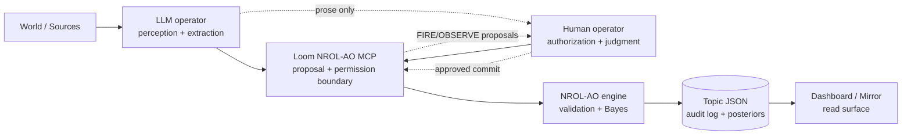
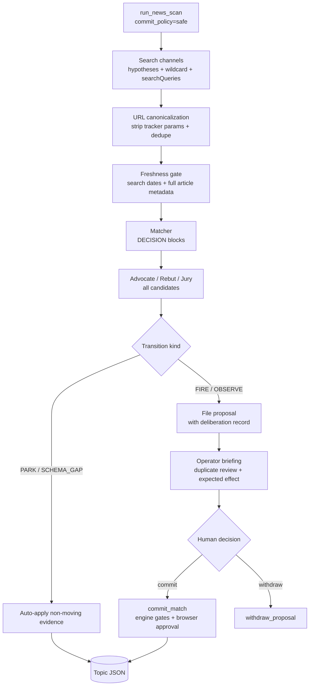
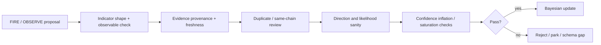

# NROL-AO

**NROL-AO** is a governor-gated Bayesian estimation engine for structured
belief updates. It is designed for a human + LLM operator pair: the LLM handles
perception and retrieval, the human authorizes consequential actions, and the
engine owns the math and state transition rules.

The core rule is simple:

> Natural language is a proposal. Only typed, schema-bound transitions can move
> beliefs.

This repo contains the engine, topic schema, governor checks, dashboards, and
supporting framework code. The live Loom MCP operator surface lives in
[`a-shadow-loom`](https://github.com/lastnpcalex/a-shadow-loom), under
`mcp_servers/nrol_ao/`.

## Current State

The project was reset after an earlier freeform-likelihood path allowed
context-anchored posterior movement outside the indicator schema. Current work
is built around stricter invariants:

- No target-posterior commits.
- Posterior movement must bind to a precommitted indicator or observable.
- Anti-indicators are canonical at top-level `indicators.anti_indicators`.
- Topic design is checked before evidence is allowed to carry weight.
- Duplicate/re-reporting risk is treated as a first-class failure mode.
- Safe scans are review-first: FIRE/OBSERVE become proposals, not direct
  posterior movement.
- Source calibration exists as infrastructure and future work; it is not a
  blanket active source-Brier weighting system in the live operator loop.

## What This Is

NROL-AO is not a prediction market and not a generic forecasting UI. It is a
small epistemic operating system for questions where the hard part is mapping
messy observations into disciplined Bayesian updates.

It provides:

- Topic files with hypotheses, priors, indicators, anti-indicators, evidence,
  actor assumptions, and governance metadata.
- A Bayesian update path where likelihoods are explicit and audit-visible.
- Governor checks for stale evidence, circular reasoning, duplicate evidence,
  unresolved contradictions, confidence inflation, prior domination, and
  schema gaps.
- A proposal workflow for LLM-discovered evidence.
- Dashboards for reading topic state and governance health.

It deliberately does not provide:

- A way for an operator or LLM to set final posteriors directly in the live
  workflow.
- Automatic belief movement from scraped news.
- A general-purpose source-reputation oracle.
- A guarantee that correlated news coverage is independent evidence.

## Authority Model



The LLM can search, summarize, classify, and propose. The human can approve or
reject. The engine validates whether the proposed transition is expressible and
computes the posterior movement.

## Topic Model

A topic is a JSON state file with these conceptual parts:

- `meta`: slug, title, status, classification, resolution criteria,
  `lastScanned`.
- `model.hypotheses`: mutually exclusive outcomes with priors/posteriors and,
  for date-bin topics, explicit ranges or midpoints.
- `indicators.tiers`: positive or directional evidence that can FIRE or be
  OBSERVEd.
- `indicators.anti_indicators`: disconfirming or contrary indicators. This
  top-level location is canonical.
- `evidenceLog`: evidence entries with provenance, time, source, claim text,
  tags, information-chain metadata, and transition audit fields.
- `governance`: health, lint issues, parked review debt, schema gaps, design
  gate results, and proposal queues.

A topic should be falsifiable: each hypothesis needs evidence paths that can
move probability down as well as up. For date-bin topics, terminal falsifiers
should be explicit, e.g. a bin is false if the qualifying resolution date falls
outside its range.

## Typed Transitions

Runtime transitions are deliberately narrow:

| Transition | Meaning | Can move posterior? |
| --- | --- | --- |
| `PARK` | Relevant evidence, no matching indicator yet | No |
| `SCHEMA_GAP` | Relevant evidence the schema cannot express | No |
| `FIRE` | Binary indicator threshold was met | Yes |
| `OBSERVE` | Numeric observable value was measured | Yes |
| `IGNORE` | Not relevant | No write |

FIRE/OBSERVE must name a real indicator. OBSERVE also requires an `observable`
block and a numeric value. The engine rejects unbound or malformed transitions.

## Safe News Scan Workflow

The live operational scan path is the Loom MCP tool `run_news_scan` with
`commit_policy="safe"`.



Important scan rules:

- `commit_policy="safe"` wins even if `commit=true` is supplied.
- PARK/SCHEMA_GAP can auto-apply because they cannot move posteriors.
- FIRE/OBSERVE must land in the proposal queue.
- Dated articles outside the adaptive scan window are dropped.
- Full-article metadata can supply a missing publication date.
- Undated FIRE/OBSERVE candidates are downgraded to PARK rather than filed as
  posterior-moving proposals.
- Repeated coverage of one causal event is corroboration, not independent
  evidence.

## Governor Gates

The governor is the enforcement layer. It checks that updates are admissible
before belief state changes are saved.



The governor is not a truth oracle. It is a discipline layer that makes bad
updates difficult to express and easy to audit.

## Source Calibration

Do not conflate source calibration with forecast calibration.

- Forecast calibration uses Brier-style scoring after hypotheses resolve.
- Source calibration is infrastructure for tracking source claims and possible
  future trust multipliers.
- The live operator loop should not assume every source has a reliable score or
  that source scores automatically weight evidence.

Planned extensions are documented in
[`specs/source-calibration-future-casts.md`](specs/source-calibration-future-casts.md):
source calibration, non-mutating future casts, and MCP red-team review for
operator-proposed future actions.

## Implementation Guide

A minimal reimplementation needs these pieces:

1. **Topic schema**: hypotheses, priors/posteriors, indicators,
   anti-indicators, evidence log, governance metadata.
2. **Transition API**: `PARK`, `SCHEMA_GAP`, `FIRE`, `OBSERVE`, `IGNORE` with
   strict validation.
3. **Bayesian update**: compute posterior from prior and likelihoods; never
   accept target posteriors as authority.
4. **Governor**: freshness, duplicate, contradiction, confidence-inflation,
   prior-domination, and admissibility gates.
5. **Design gate**: catch missing resolution criteria, weak falsifiability,
   asymmetric indicator coverage, indistinguishable hypotheses, and unjustified
   priors before a topic goes live.
6. **Proposal store**: queue posterior-moving candidates for human review.
7. **Safe scan worker**: search, dedupe, freshness-gate, match, deliberate,
   auto-apply non-moving evidence, and queue FIRE/OBSERVE.
8. **Audit surface**: every committed transition needs evidence, reason,
   provenance, before/after posteriors, and gate result.

## Repository Map

```text
engine.py                  Topic I/O, evidence entry, Bayesian update, save path
governor.py                Governance/admissibility checks
framework/pipeline.py      Evidence processing helpers
framework/news_*           News scan planning/mutation/matcher support
framework/topic_design_gate.py  Topic design linting and adversarial prompt support
framework/scoring.py       Resolution and Brier scoring support
framework/source_*         Source-ledger/source-db infrastructure
server.py                  Standalone HTTP dashboard
loom/                      Static dashboard/canvas assets
specs/                     Future-facing feature specs
skills/                    Operator prompt/workflow docs
```

## Running Locally

```bash
python engine.py list
python engine.py show <topic-slug>
python governor.py report <topic-slug>
python server.py
```

For the live operator workflow, run the Loom MCP integration from the Loom repo.
The NROL MCP server is intentionally outside this repo so the engine remains a
library and the operator boundary remains explicit.

## Design Principle

The point is not to make the LLM "better at forecasting" by itself. The point
is to divide labor cleanly:

- LLMs are good at perception over messy text.
- Humans are responsible for priorities and authorization.
- The engine is responsible for math, constraints, and memory.
- The governor is responsible for making unsafe updates hard to commit.

That division is the product.
