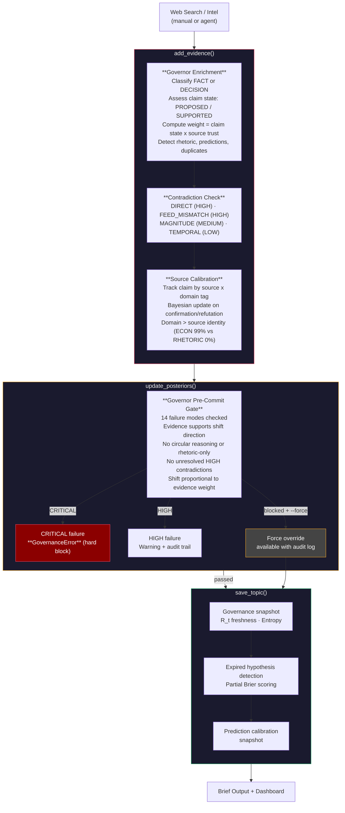
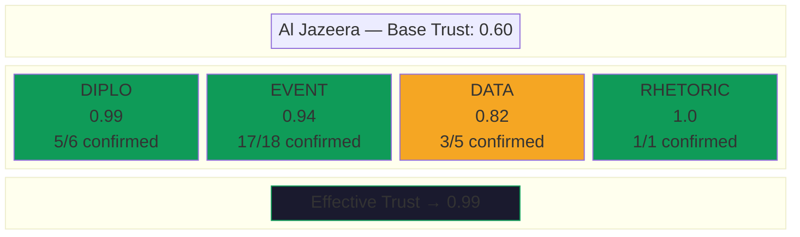
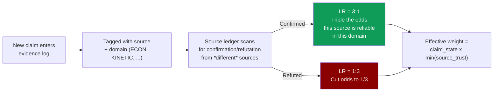
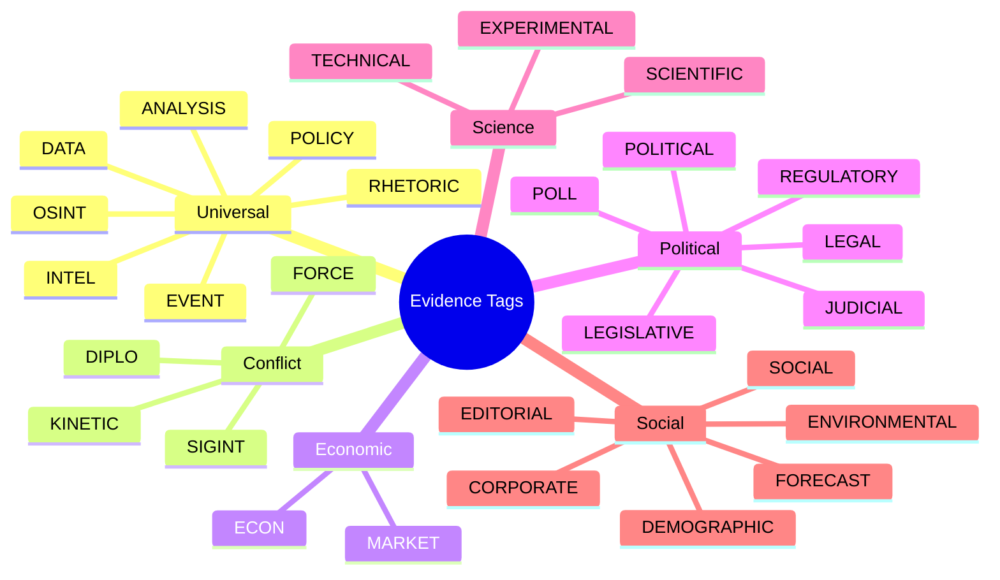

<p align="center">
  
</p>

# NRL-Alpha Omega

**Governor-gated Bayesian estimation engine for tracking Current Things.**

A framework for decomposing any predictive question into hypotheses, indicators, evidence, and actor models — then maintaining posteriors with epistemic discipline. Evidence-first, never vibes. The governor enforces that discipline automatically: rhetoric can't move posteriors, stale evidence gets flagged, sources earn trust through track record, and contradictions block updates until resolved.

## Why This Exists

Forecasting hard questions — "how long will the Strait of Hormuz stay closed?" — is easy to do badly. Common failure modes:

1. **Anchoring**: you pick a number and then find evidence to support it
2. **Source laundering**: a rumor gets repeated across outlets and starts looking like consensus
3. **Rhetoric-as-evidence**: a politician's threat gets treated like an observed event
4. **Stale priors**: yesterday's assessment gets copy-pasted as today's with no new information
5. **Confirmation bias**: counterevidence gets lower weight because it's inconvenient

This engine makes all of those structurally harder to do. Every mutation — adding evidence, shifting posteriors, updating sub-models — passes through governance checks. The system tracks its own calibration (Brier scores), detects contradictions in the evidence log, and maintains domain-specific trust ratings for sources based on their empirical track record.

The goal isn't to be right. The goal is to *know how wrong you are* and get less wrong over time.

## How It Works



## Source Trust: How It Updates

Sources don't have a single trust score. Trust is tracked **per domain** — a source that's excellent at reporting economic data might be unreliable on diplomatic analysis.



The update mechanism is Bayesian:



A source confirmed 5 times in ECON and refuted 3 times in RHETORIC will have high ECON trust and low RHETORIC trust. When that source makes a new ECON claim, it gets high weight. When it makes a RHETORIC claim, it gets low weight. The system learns this automatically from the evidence log.

**Key finding from testing against live data**: domain predicts reliability far better than source identity (r=0.159 for source alone). ECON claims are 99.4% reliable across all sources; RHETORIC claims are 0% reliable.

## Architecture

```
engine.py                  Topic I/O, add_evidence, update_posteriors, save_topic
governor.py                Epistemic governor — 14 failure modes, R_t, entropy, claim lifecycle
server.py                  Multi-topic HTTP dashboard (port 8098)

framework/
├── update.py              Programmatic update pipeline (routine/crisis modes)
├── red_team.py            Devil's advocate — counterevidence scoring, contrarian analysis
├── contradictions.py      Multi-type contradiction detection with severity tiers
├── scoring.py             Brier score calibration, hypothesis expiry, partial scoring
├── source_ledger.py       Claim resolution tracking, Bayesian source trust updates
├── source_db.py           Cross-topic, domain-aware source performance database
├── compaction.py          Evidence log compaction (preserves key claims + weights)
├── calibrate.py           Base source trust scores, verification functions
├── runner.py              CLI orchestrator
├── lint.py                Evidence log linting (failure mode checks)
└── test.py                Hypothesis test registry

topics/                    One JSON state file per active topic (gitignored)
briefs/                    Generated intelligence briefs per topic (gitignored)
sources/                   Source database (cross-topic trust tracking)
```

### Key Invariant

**Every mutation goes through the governor.** Never write directly to `topic["evidenceLog"]`, `topic["model"]["hypotheses"]`, or `topic["subModels"]`. Always use `add_evidence()`, `update_posteriors()`, `update_submodel()`, `hold_posteriors()`. The governor enriches, validates, and gates every change.

## Quickstart

```bash
# List topics
python engine.py list

# Show topic state
python engine.py show hormuz-closure

# Run a governance report
python governor.py report hormuz-closure

# Run a full update cycle
python framework/runner.py update --topic hormuz-closure --mode routine

# Lint the evidence log
python framework/runner.py lint --topic hormuz-closure

# Run the red team
python -c "
from engine import load_topic
from framework.red_team import generate_red_team, format_red_team_challenge
topic = load_topic('hormuz-closure')
red = generate_red_team(topic, topic['model']['hypotheses'])
print(format_red_team_challenge(red))
"

# Check calibration
python framework/scoring.py hormuz-closure --report

# Ingest source data into the cross-topic database
python framework/source_db.py ingest --topic hormuz-closure

# Launch the dashboard
python server.py
```

## Creating a New Topic

1. Copy `topics/_template.json` to `topics/{your-slug}.json`
2. Set `meta.topicType` to one of: `conflict`, `science`, `election`, `tech` (or leave empty for custom)
3. Fill in: question, resolution criterion, hypotheses (with midpoints), indicators, actor model
4. Wire up data feeds with baseline values
5. Choose relevant tags from the tag registry (see below) and list them in `tagConfig.availableTags`
6. Run `python engine.py show your-slug` to verify the governor accepts it
7. Start adding evidence — the system handles enrichment, claim states, and calibration automatically

## Evidence Tags

Tags classify evidence by domain. Each tag has a TTL (how fast it goes stale), a fact/decision classification, and optional direction hints for the red team's heuristic inference.

The system ships with **28 tags** across 6 categories. Pick the ones relevant to your topic:



### Topic Type Presets

Setting `meta.topicType` in your topic JSON automatically configures which tags the red team uses for direction inference:

| Topic Type | Example Use Cases | Key Tags | Direction Logic |
|-----------|-------------------|----------|----------------|
| `conflict` | Wars, crises, blockades | KINETIC, FORCE, DIPLO, ECON | Kinetic events argue for longer timelines; diplomacy argues shorter |
| `science` | LK-99, replication studies | EXPERIMENTAL, SCIENTIFIC, TECHNICAL | Lab results and papers push toward confirmation |
| `election` | Elections, referenda | POLL, POLITICAL, LEGAL | Neutral — direction from content, not tag |
| `tech` | AI capabilities, product launches | TECHNICAL, SCIENTIFIC, REGULATORY | Technical demos argue "sooner"; regulation argues "slower" |

### Custom Tag Configuration

For topics that don't fit a preset, configure `tagConfig` in the topic JSON:

```json
{
  "tagConfig": {
    "availableTags": ["EVENT", "DATA", "SCIENTIFIC", "EXPERIMENTAL", "RHETORIC"],
    "directionHints": {
      "EXPERIMENTAL": {"H1": 1, "H2": 1, "H3": -1},
      "SCIENTIFIC": {"H1": 1}
    },
    "escalationTags": ["EXPERIMENTAL"],
    "deescalationTags": ["RHETORIC"]
  }
}
```

## Epistemic Governance

The governor (`governor.py`) enforces analytical discipline through multiple mechanisms:

| Mechanism | What It Does |
|-----------|-------------|
| **R_t = PD/E** | Evidence freshness scoring — SAFE / ELASTIC / DANGEROUS / RUNAWAY |
| **14 Failure Modes** | Pre-commit checklist (3 CRITICAL, 5 HIGH, 3 MEDIUM, 3 LOW) |
| **Dual Ledger** | Facts (auto-decay) vs decisions (explicit supersession) |
| **Claim Lifecycle** | PROPOSED → SUPPORTED → CONTESTED → INVALIDATED |
| **Contradiction Detection** | DIRECT, FEED_MISMATCH, MAGNITUDE, TEMPORAL — with severity tiers |
| **Source Trust Weighting** | Evidence weight = claim_state × domain-specific source trust |
| **Prediction Detection** | Future-tense claims auto-downgraded to PROPOSED (0.5 weight) |
| **Rhetoric Guard** | RHETORIC-tagged evidence used to justify shifts triggers failure |
| **Hypothesis Expiry** | Auto-detects when dayCount exceeds hypothesis midpoint × 1.5 |
| **Brier Score Tracking** | Snapshot posteriors at each update; score against outcomes |
| **Entropy Monitoring** | Tracks posterior distribution spread for calibration health |

### Hallucination Failure Modes (14 total)

| # | Mode | Severity | Trigger |
|---|------|----------|---------|
| 1 | no_evidence | CRITICAL | Posterior shift with no supporting evidence |
| 2 | circular_reasoning | CRITICAL | Evidence cites its own posterior as support |
| 3 | unresolved_contradiction | CRITICAL | HIGH-severity contradiction + shift > 0.02 |
| 4 | stale_evidence | HIGH | >50% of evidence older than R_t window |
| 5 | rhetoric_as_evidence | HIGH | RHETORIC tag used to justify shift |
| 6 | prediction_treated_as_fact | HIGH | Future-tense claim at OBSERVED weight |
| 7 | anchoring | HIGH | Shift too small given evidence weight |
| 8 | source_laundering | HIGH | Same claim from same source counted twice |
| 9 | magnitude_mismatch | MEDIUM | Shift size doesn't match evidence strength |
| 10 | missing_counterevidence | MEDIUM | No devil's advocate check before shift |
| 11 | unfalsifiable_hypothesis | MEDIUM | Hypothesis has no observable resolution |
| 12 | temporal_confusion | LOW | Evidence timestamp inconsistent with claim |
| 13 | feed_key_mismatch | LOW | Data feed reference doesn't match topic |
| 14 | duplicate_evidence | LOW | Semantic duplicate of existing entry |

## Acknowledgments

The epistemic governance layer builds on patterns from **[@unpingable](https://github.com/unpingable)**'s **[Agent Governor](https://github.com/unpingable/agent_governor)** framework:

- The **R_t = PD/E control equation** for evidence freshness scoring
- The **dual-ledger design** (facts vs decisions) for separating observations from analytical choices
- The **claim lifecycle** (PROPOSED → SUPPORTED → CONTESTED → INVALIDATED) for evidence state
- **Admissibility gating** for hypothesis quality (setpoint clarity + observability)
- **Value of Information** for directing search effort
- The **hallucination failure modes** (extended from 11 to 14) as a pre-commit checklist
- The **monotonic constraint compiler** adapted as constraint chain auditing

Agent Governor's core insight — "natural language is a proposal, not an authority" — maps directly to Bayesian estimation: rhetoric is a proposal, only verified evidence moves posteriors.

## License

Do what you want with it. *Delenda est Current Thing.*
