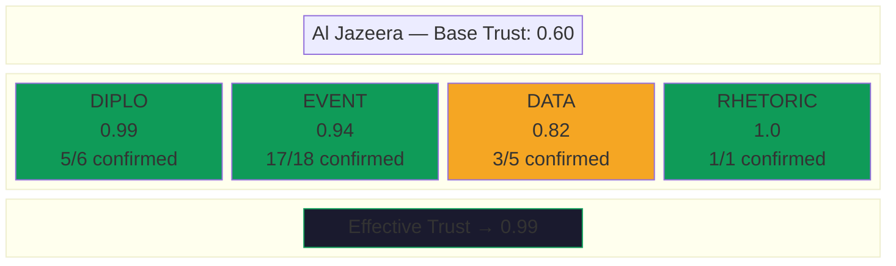
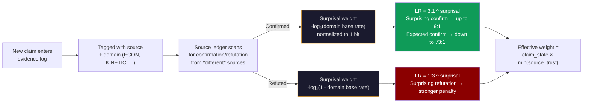

<p align="center">
  
  <br/>
  <sub>Simplified vector files available (AI/SVG). Patch art inspired by <a href="https://github.com/vgel">@vgel</a>.</sub>
</p>

# NROL-αΩ

**Necro Rationalist Operations Laboratory-αΩ** — Governor-gated Bayesian estimation engine for tracking Current Things.

A framework for decomposing any predictive question into hypotheses, indicators, evidence, and actor models — then maintaining posteriors with epistemic discipline. Evidence-first, never vibes. The governor enforces that discipline automatically: rhetoric can't move posteriors, stale evidence gets flagged, sources earn trust through track record, and contradictions block updates until resolved.

## Why This Exists

Forecasting hard questions — "how long will the Strait of Hormuz stay closed?" — is easy to do badly. Common failure modes:

1. **Anchoring**: you pick a number and then find evidence to support it
2. **Source laundering**: a rumor gets repeated across outlets and starts looking like consensus
3. **Rhetoric-as-evidence**: a politician's threat gets treated like an observed event
4. **Stale priors**: yesterday's assessment gets copy-pasted as today's with no new information
5. **Confirmation bias**: counterevidence gets lower weight because it's inconvenient

This engine makes all of those structurally harder to do. Every mutation — adding evidence, shifting posteriors, updating sub-models — passes through governance checks. The system tracks its own calibration (Brier scores), detects contradictions in the evidence log, and maintains domain-specific trust ratings for sources based on their empirical track record.

The goal isn't to be right. The goal is to *know how wrong you are* and get less wrong over time.

### Epistemic Limitations

This engine is honest about what it is and what it isn't.

**What it is**: a Bayesian estimation engine where the update mechanics are principled and the governance layer enforces epistemic discipline. Posteriors are computed via Bayes' theorem from explicit likelihoods. Evidence weight feeds back into the update via a probabilistic mixture model — contested evidence is treated as a mixture of signal and noise, not discarded or blindly trusted. Source trust is Bayesian-updated per domain with surprisal-weighted likelihood ratios, so a source correctly predicting something surprising earns more trust than one confirming the obvious. Calibration is tracked via Brier scores and fed back into governance health.

**What it isn't**: a generative model. The likelihoods in `bayesian_update()` are operator-supplied or derived from pre-committed indicator definitions via `suggest_likelihoods()`. There is no forward model that predicts what evidence you'd observe under each hypothesis — that would require a causal model of the domain (geopolitics, science, markets), which is an open research problem. The engine is Bayesian in its update mechanics, its source calibration, and its information-theoretic monitoring. The human judgment lives in the indicator design and the decision to fire them. Everything downstream of that judgment is mechanical.

#### Known limitation: conditional dependence between evidence

Intelligence sources are correlated in ways that are often opaque and dynamic. A Reuters correspondent in Dubai and an AP correspondent in Dubai might be independently reporting, or they might both be working off the same CENTCOM background briefing. The engine provides **information-chain tracking** (`informationChain` field on evidence entries) so operators can declare when entries trace to the same primary source — and the governor will not count same-chain entries as independent corroboration. But this requires the operator to *know* the dependency structure, which is often unknowable.

A proper Bayesian treatment would model the full joint distribution over sources. This engine does not attempt that. Instead, it takes the pragmatic position: make dependencies *declarable* when known, discount same-chain evidence automatically, and accept that undeclared dependencies will occasionally inflate confidence. The calibration feedback loop (Brier scores over time) is the long-run corrective — if correlated evidence is systematically overcounted, calibration will degrade, and the operator will see it.

This is an honest limitation, not a planned feature. If you have ideas for tractable approaches to source-correlation modeling in sparse-evidence domains, we'd like to hear them.

## How It Works


## Bayesian & Information-Theoretic Mechanics

The engine implements several formal mechanisms from Bayesian inference and information theory. These aren't decorative — they're load-bearing parts of the update pipeline that control how evidence flows into posteriors.

### Posterior Updates via Bayes' Theorem

`bayesian_update()` computes posteriors mechanically:

$$P(H_i|E) = \frac{P(E|H_i) \cdot P(H_i)}{\sum_j P(E|H_j) \cdot P(H_j)}$$

The operator supplies likelihoods P(E|H_i) for each hypothesis — "how probable is this evidence if H_i is true?" — and the engine handles the rest. Both raw and adjusted likelihoods are recorded in `posteriorHistory` for full auditability.

### Evidence Weight Attenuation (Mixture Model)

Evidence quality feeds into the Bayes computation through a proper probabilistic mixture model. Each piece of cited evidence has an `effectiveWeight` *w* representing the probability that the evidence is genuine signal rather than noise:

$$P(E|H_i) = w \cdot P(E|H_i,\text{real}) + (1-w) \cdot P(E|\text{noise})$$

where P(E|noise) = mean of raw likelihoods across all hypotheses (uninformative — identical for all H, so the noise component produces zero posterior movement after normalization). At *w*=1.0, the full likelihood passes through. At *w*=0, all hypotheses receive the same likelihood and posteriors don't move. At intermediate weights, the update is attenuated proportionally. Unlike a linear interpolation toward a fixed neutral value, this formulation is coherent: it corresponds to a well-defined generative model ("the evidence is real with probability *w*, noise otherwise") and preserves the direction of all likelihood ratios at every weight level.

`effectiveWeight` itself is the product of two factors:
- **Claim state weight**: PROPOSED (0.5) → SUPPORTED (1.0) → CONTESTED (0.2) → INVALIDATED (0.0)
- **Source trust**: Bayesian-updated per source per domain, starting from base priors and refined by claim resolution history with surprisal weighting

### Inverse Bayes: Likelihoods from Indicators

`suggest_likelihoods()` reverses the Bayes computation. Given indicator-defined posterior shifts (e.g. "H3 +15pp"), it derives the likelihoods that would produce those shifts:

$$L(H_i) \propto \frac{P_{\text{target}}(H_i)}{P_{\text{current}}(H_i)}$$

For indicators referencing sub-model scenarios (e.g. "Kharg +10pp"), the function resolves through the topic's conditional probability tables — `P(H_i | \text{scenario})` — to translate sub-model movements into hypothesis-level likelihood ratios.

### KL Divergence — Two Applications

**Prior-domination detection** (`compute_kl_from_prior`): Measures D_KL(current posterior ‖ initial prior). Low entropy + low KL = the model is confident but hasn't moved far from where it started — a sign that confidence is inherited from the prior rather than earned from evidence. The governance system flags this as `PRIOR_DOMINATED`.

**Operator-vs-mechanical divergence** (inside `bayesian_update`): When the operator supplies both likelihoods and their intuitive posteriors, the engine computes D_KL(mechanical ‖ intuitive). Divergence > 0.05 nats triggers a governance note. The mechanical result always wins, but the divergence is logged — making the gap between "what the math says" and "what the operator expected" visible and auditable.

### Shannon Entropy and R_t

The posterior distribution's Shannon entropy H = −Σ p_i log₂(p_i) drives several mechanisms:

- **Uncertainty ratio** (H / H_max): 1.0 = uniform (maximum ignorance), 0.0 = all mass on one hypothesis. Governance flags both extremes — near-maximum means the model isn't discriminating, near-zero means check for overconfidence.
- **R_t (evidence staleness risk)**: For each hypothesis, R_t = (entropy contribution × time decay) / evidence recency. Hypotheses that carry high Shannon information (especially low-probability tail hypotheses with high surprise value if true) and haven't been refreshed recently get high R_t scores. This drives the Value of Information system: queries that could resolve high-R_t hypotheses are prioritized.
- **VoI query prioritization**: When entropy is high, the system prioritizes discriminating queries (which hypothesis is right?). When entropy is low, it prioritizes disconfirmation queries (is the leading hypothesis actually wrong?). Unfired high-tier indicators always rank highest.

### Brier Score Calibration

Every posterior update triggers a prediction snapshot. When a topic resolves, `record_outcome()` scores all historical snapshots against ground truth using the Brier score:

$$BS = \frac{1}{N} \sum_{i=1}^{N} (p_i - o_i)^2$$

where *o_i* = 1 for the correct hypothesis, 0 otherwise. Brier scores feed back into governance health — `POORLY_CALIBRATED` (Brier > 0.4) degrades system health. Hypotheses that expire by time (day count exceeds 1.5× the midpoint) get partial Brier scoring without waiting for full topic resolution.

### Bayesian Source Trust with Surprisal Weighting

Source trust isn't a static lookup table. The source ledger tracks claim outcomes per source per domain tag (ECON, KINETIC, DIPLO, etc.) and updates trust via Bayesian likelihood ratios — weighted by how surprising the resolved claim was.

Base LRs (cross-topic): confirmed → LR 3:1, refuted → LR 1:3. Per-topic: confirmed → LR 1.2, refuted → LR 0.7. These are then exponentiated by a surprisal weight:

$$LR_{\text{eff}} = LR_{\text{base}}^{s}, \quad s = \text{clamp}\left(\frac{-\log_2(p_{\text{domain}})}{1\text{ bit}},\ 0.5,\ 2.0\right)$$

where *p*_domain is the confirmation base rate for this domain tag. A source that correctly called something surprising (low base rate of confirmation in that domain) earns up to 2× the trust credit. A source that confirmed the obvious (high base rate) earns as little as 0.5×. This prevents "oil goes up during a war" from earning the same trust boost as "Iran releases hostages by Tuesday." The normalizer of 1 bit means a coin-flip base rate (p=0.5) produces weight 1.0 — the unsurprised default.

Trust is stored and queried at four levels of specificity (first match wins): per-topic calibration → cross-topic domain trust → cross-topic overall trust → static base prior. The minimum trust across all cited sources is used (conservative).

## Source Trust: How It Updates

Sources don't have a single trust score. Trust is tracked **per domain** — a source that's excellent at reporting economic data might be unreliable on diplomatic analysis.



The update mechanism is Bayesian with surprisal weighting:



A source confirmed 5 times in ECON and refuted 3 times in RHETORIC will have high ECON trust and low RHETORIC trust. When that source makes a new ECON claim, it gets high weight. When it makes a RHETORIC claim, it gets low weight. The system learns this automatically from the evidence log. Crucially, the five ECON confirmations don't all count equally — if the domain base rate is 99% (ECON claims are almost always confirmed), each confirmation earns minimal trust credit. A single correct call in a domain where sources are usually wrong is worth more than five correct calls where everyone is right.

**Key finding from testing against live data**: domain predicts reliability far better than source identity (r=0.159 for source alone). ECON claims are 99.4% reliable across all sources; RHETORIC claims are 0% reliable.

## Architecture

```
engine.py                  Topic I/O, add_evidence, update_posteriors, bayesian_update, suggest_likelihoods, save_topic
governor.py                Epistemic governor — 14 failure modes, R_t, entropy, KL from prior, claim lifecycle
server.py                  Multi-topic HTTP dashboard (port 8098)

framework/
├── update.py              Programmatic update pipeline (routine/crisis modes)
├── red_team.py            Devil's advocate — counterevidence scoring, contrarian analysis
├── contradictions.py      Multi-type contradiction detection with severity tiers
├── scoring.py             Brier score calibration, hypothesis expiry, partial scoring
├── source_ledger.py       Claim resolution tracking, Bayesian source trust updates
├── source_db.py           Cross-topic, domain-aware source performance database
├── backfill.py            Historical backfill + outcome-based source scoring
├── compaction.py          Evidence log compaction (preserves key claims + weights)
├── calibrate.py           Base source trust scores, verification functions
├── runner.py              CLI orchestrator
├── lint.py                Evidence log linting (failure mode checks)
└── test.py                Hypothesis test registry

topics/                    One JSON state file per active topic (gitignored)
briefs/                    Generated intelligence briefs per topic (gitignored)
sources/                   Source database (cross-topic trust tracking)
```

### Key Invariant

**Every mutation goes through the governor.** Never write directly to `topic["evidenceLog"]`, `topic["model"]["hypotheses"]`, or `topic["subModels"]`. Always use `add_evidence()`, `update_posteriors()` / `bayesian_update()`, `update_submodel()`, `hold_posteriors()`. The governor enriches, validates, and gates every change.

Two paths for posterior updates:
- **`update_posteriors()`** — operator supplies final posteriors directly. The governor validates them against the hallucination checklist but the Bayesian math is implicit (in the operator's head).
- **`bayesian_update()`** — operator supplies explicit likelihoods `P(E|H_i)` and the engine computes posteriors mechanically via Bayes' theorem. Same governor gate, but the reasoning is auditable: likelihoods are recorded in `posteriorHistory`. Likelihoods are attenuated by the `effectiveWeight` of cited evidence — contested or low-trust evidence produces weaker updates automatically.
- **`suggest_likelihoods()`** — converts fired indicator `posteriorEffect` strings into likelihood ratios via inverse Bayes. Parses explicit pp shifts, qualitative directions (`H3/H4 surge`), and submodel references (resolved through conditional distributions). Returns a structured suggestion for operator review before passing to `bayesian_update()`.

## Quickstart

```bash
# List topics
python engine.py list

# Show topic state
python engine.py show hormuz-closure

# Run a governance report
python governor.py report hormuz-closure

# Run a full update cycle
python framework/runner.py update --topic hormuz-closure --mode routine

# Lint the evidence log
python framework/runner.py lint --topic hormuz-closure

# Run the red team
python -c "
from engine import load_topic
from framework.red_team import generate_red_team, format_red_team_challenge
topic = load_topic('hormuz-closure')
red = generate_red_team(topic, topic['model']['hypotheses'])
print(format_red_team_challenge(red))
"

# Check calibration
python framework/scoring.py hormuz-closure --report

# Ingest source data into the cross-topic database
python framework/source_db.py ingest --topic hormuz-closure

# Launch the dashboard
python server.py
```

## Dashboard

`python server.py` launches a real-time dashboard on port 8098 (binds `0.0.0.0` — accessible over Tailscale or LAN). The dashboard auto-detects all topics in `topics/` and renders:

- Posterior distribution bar + historical chart
- Sub-models with scenarios, deadlines, and conditional probabilities
- Indicator status across all tiers (with fired/pending states)
- Data feeds with baseline deltas
- Evidence log (latest 20, color-coded by tag)
- Actor model and methodology rules
- Epistemic governor health (R_t regime, entropy, admissibility, issues)
- Value of Information priority queries

Select topics from the dropdown. Auto-refreshes every 60 seconds.

## Requirements

Python 3.10+. Zero external dependencies — stdlib only. No pip install, no venv, no requirements.txt.

## Example: LK-99 Superconductor (Resolved)

The repo includes a historical reconstruction of the LK-99 room-temperature superconductor saga (July-August 2023) as a worked example of the full topic lifecycle.

**Question**: Is LK-99 a room-temperature, ambient-pressure superconductor?

**Hypotheses**:
- H1: Genuine RT superconductor (prior: 0.10)
- H2: Partial — real but not full SC (prior: 0.20)
- H3: Not SC — mundane explanation (prior: 0.50)
- H4: Fraud or severe methodological failure (prior: 0.20)

**Posterior evolution** over 25 days:

```
H3 ███████████████████████████████████████████████ 0.90  ← Cu2S impurity
H1 █                                               0.01
H2 █                                               0.02
H4 ████                                            0.07
```

**What the system caught**:
- Social media hype (RHETORIC tag) → zero posterior movement, correctly ignored
- Huazhong partial levitation video → H2 bump only, not H1 (partial signal ≠ Meissner)
- DFT flat bands (LBNL) → small H1/H2 boost (theoretical support, not proof)
- 6+ failed replications → bulk failure indicator fired, H3 surged
- Cu2S phase transition identified → smoking gun, H3 locked in

**Governance snapshot at resolution**:
- **KL from prior**: 0.39 nats → `MODERATE`. The prior already favored H3 (0.50), so reaching H3=0.90 was a significant move but not a reversal. Honest classification: the evidence confirmed a direction the prior already leaned, rather than overturning it.
- **R_t**: all hypotheses `SAFE` — evidence was fresh at time of resolution.
- **Health**: `DEGRADED` (post-resolution, all 15 evidence entries have aged past TTL — expected for a closed topic).

**How `bayesian_update()` would have worked** (retrospective):

The Aug 3 update (6+ failed replications) could have been expressed as explicit likelihoods:

```python
# If H3 is true (mundane), how likely are 6 failed replications? Very.
# If H1 is true (genuine SC), how likely are 6 failures? Very unlikely.
bayesian_update(topic, likelihoods={
    "H1": 0.05,   # P(6 failures | genuine SC) — almost impossible
    "H2": 0.30,   # P(6 failures | partial SC) — possible if effect is subtle
    "H3": 0.90,   # P(6 failures | not SC) — expected
    "H4": 0.60,   # P(6 failures | fraud) — expected but not certain
}, reason="6+ independent replication failures", evidence_refs=[...])
```

The engine computes posteriors mechanically via Bayes' theorem. If the cited evidence has low `effectiveWeight` (contested claims, low-trust sources), the likelihoods are attenuated via the mixture model — the evidence is treated as a probability-weighted mix of genuine signal and uninformative noise, so weak evidence produces proportionally weaker posterior shifts without distorting likelihood direction. If the operator also supplies their intuitive posteriors, the system logs the KL divergence between mechanical and intuitive results — making the gap between math and intuition visible.

**`suggest_likelihoods()`** — instead of hand-crafting likelihoods, derive them from pre-committed indicator definitions. Indicators are defined at topic creation before the evidence arrives — they're a pre-registered analysis plan, not a post-hoc rationalization. When an indicator fires, the function mechanizes what the operator already committed to:

```python
# Fire an indicator, then get suggested likelihoods
fire_indicator(topic, "t1_bulk_failure", note="6+ labs failed to replicate")
suggestion = suggest_likelihoods(topic, ["t1_bulk_failure"])
# suggestion["suggested_likelihoods"] = {"H1": 0.05, "H2": 0.30, "H3": 1.0, "H4": 0.60}
# suggestion["target_posteriors"] = {"H1": 0.01, "H2": 0.03, "H3": 0.93, "H4": 0.03}
# suggestion["ready"] = True

# Review, optionally adjust, then apply
bayesian_update(topic, suggestion["suggested_likelihoods"],
                reason="6+ replication failures", evidence_refs=[...])
```

For indicators with unparseable effects (e.g. "Thesis confirmation"), `ready` returns `False` and the operator can supply overrides via `override_effects={"indicator_id": {"H1": +5, "H3": -3}}`.

**Information chains** (retrospective): Multiple outlets reported the Huazhong levitation video. Without `informationChain` tracking, each article could have been counted as independent corroboration. With it:

```python
add_evidence(topic, {
    "tag": "EXPERIMENTAL", "source": "reuters",
    "text": "Huazhong University video shows partial levitation of LK-99 sample",
    "informationChain": "huazhong-levitation-video-2023-07",  # same primary source
})
add_evidence(topic, {
    "tag": "EXPERIMENTAL", "source": "scmp",
    "text": "Chinese university demonstrates LK-99 sample levitating",
    "informationChain": "huazhong-levitation-video-2023-07",  # same video, same chain
})
# Governor treats these as ONE evidential unit, not independent corroboration
```

**Source trust after outcome scoring** (carried into future science topics):

| Source | Domain Trust | Why |
|--------|-------------|-----|
| arXiv (Lee & Kim) | 0.25 | Made the wrong claim (20 years sunk cost) |
| Huazhong University | 0.10 | Viral video was ferromagnetic Cu2S, not Meissner |
| IBS Korea (single crystal) | 0.75 | Definitive negative result |
| University of Maryland | 0.75 | Identified the Cu2S mechanism |

If Huazhong publishes an EXPERIMENTAL claim on the next science topic, the governor starts them at 0.10 domain trust instead of 0.50. They have to earn it back.

To explore the LK-99 topic: `python engine.py show lk99-superconductor`

## Creating a New Topic

1. Copy `topics/_template.json` to `topics/{your-slug}.json`
2. Set `meta.topicType` to one of: `conflict`, `science`, `election`, `tech` (or leave empty for custom)
3. Fill in: question, resolution criterion, hypotheses (with midpoints), indicators, actor model
4. Wire up data feeds with baseline values
5. Choose relevant tags from the tag registry (see below) and list them in `tagConfig.availableTags`
6. Run `python engine.py show your-slug` to verify the governor accepts it
7. Start adding evidence — the system handles enrichment, claim states, and calibration automatically

## Evidence Tags

Tags classify evidence by domain. Each tag has a TTL (how fast it goes stale), a fact/decision classification, and optional direction hints for the red team's heuristic inference.

The system ships with **28 tags** across 6 categories. Pick the ones relevant to your topic:

| Category | Tags |
|----------|------|
| **Universal** | `EVENT` `DATA` `RHETORIC` `INTEL` `ANALYSIS` `OSINT` `POLICY` |
| **Conflict** | `KINETIC` `FORCE` `DIPLO` `SIGINT` |
| **Economic** | `ECON` `MARKET` |
| **Political** | `POLITICAL` `POLL` `LEGAL` `REGULATORY` `JUDICIAL` `LEGISLATIVE` |
| **Science** | `SCIENTIFIC` `EXPERIMENTAL` `TECHNICAL` |
| **Social** | `CORPORATE` `DEMOGRAPHIC` `SOCIAL` `ENVIRONMENTAL` `EDITORIAL` `FORECAST` |

### Topic Type Presets

Setting `meta.topicType` in your topic JSON automatically configures which tags the red team uses for direction inference:

| Topic Type | Example Use Cases | Key Tags | Direction Logic |
|-----------|-------------------|----------|----------------|
| `conflict` | Wars, crises, blockades | KINETIC, FORCE, DIPLO, ECON | Kinetic events argue for longer timelines; diplomacy argues shorter |
| `science` | LK-99, replication studies | EXPERIMENTAL, SCIENTIFIC, TECHNICAL | Lab results and papers push toward confirmation |
| `election` | Elections, referenda | POLL, POLITICAL, LEGAL | Neutral — direction from content, not tag |
| `tech` | AI capabilities, product launches | TECHNICAL, SCIENTIFIC, REGULATORY | Technical demos argue "sooner"; regulation argues "slower" |

### Custom Tag Configuration

For topics that don't fit a preset, configure `tagConfig` in the topic JSON:

```json
{
  "tagConfig": {
    "availableTags": ["EVENT", "DATA", "SCIENTIFIC", "EXPERIMENTAL", "RHETORIC"],
    "directionHints": {
      "EXPERIMENTAL": {"H1": 1, "H2": 1, "H3": -1},
      "SCIENTIFIC": {"H1": 1}
    },
    "escalationTags": ["EXPERIMENTAL"],
    "deescalationTags": ["RHETORIC"]
  }
}
```

## Epistemic Governance

The governor (`governor.py`) enforces analytical discipline through multiple mechanisms:

| Mechanism | What It Does |
|-----------|-------------|
| **R_t (info-theoretic)** | Evidence freshness scoring — entropy contribution × log-time decay / evidence recency → SAFE / ELASTIC / DANGEROUS / RUNAWAY |
| **14 Failure Modes** | Pre-commit checklist (3 CRITICAL, 5 HIGH, 3 MEDIUM, 3 LOW) |
| **Dual Ledger** | Facts (auto-decay) vs decisions (explicit supersession) |
| **Claim Lifecycle** | PROPOSED → SUPPORTED → CONTESTED → INVALIDATED |
| **Contradiction Detection** | DIRECT, FEED_MISMATCH, MAGNITUDE, TEMPORAL — with severity tiers |
| **Source Trust Weighting** | Evidence weight = claim_state × domain-specific source trust |
| **Prediction Detection** | Future-tense claims auto-downgraded to PROPOSED (0.5 weight) |
| **Rhetoric Guard** | RHETORIC-tagged evidence used to justify shifts triggers failure |
| **Hypothesis Expiry** | Auto-detects when dayCount exceeds hypothesis midpoint × 1.5 |
| **Brier Score Tracking** | Snapshot posteriors at each update; score against outcomes |
| **Entropy Monitoring** | Tracks posterior distribution spread for calibration health |
| **KL from Prior** | Detects prior-dominated confidence — sharp posteriors that never moved from the initial prior |
| **Information Chains** | Evidence entries sharing an `informationChain` ID are treated as one evidential unit, not independent corroboration |

### Hallucination Failure Modes (14 total)

| # | Mode | Severity | Trigger |
|---|------|----------|---------|
| 1 | no_evidence | CRITICAL | Posterior shift with no supporting evidence |
| 2 | circular_reasoning | CRITICAL | Evidence cites its own posterior as support |
| 3 | unresolved_contradiction | CRITICAL | HIGH-severity contradiction + shift > 0.02 |
| 4 | stale_evidence | HIGH | >50% of evidence older than R_t window |
| 5 | rhetoric_as_evidence | HIGH | RHETORIC tag used to justify shift |
| 6 | prediction_treated_as_fact | HIGH | Future-tense claim at OBSERVED weight |
| 7 | anchoring | HIGH | Shift too small given evidence weight |
| 8 | source_laundering | HIGH | Same claim from same source counted twice |
| 9 | magnitude_mismatch | MEDIUM | Shift size doesn't match evidence strength |
| 10 | missing_counterevidence | MEDIUM | No devil's advocate check before shift |
| 11 | unfalsifiable_hypothesis | MEDIUM | Hypothesis has no observable resolution |
| 12 | temporal_confusion | LOW | Evidence timestamp inconsistent with claim |
| 13 | feed_key_mismatch | LOW | Data feed reference doesn't match topic |
| 14 | duplicate_evidence | LOW | Semantic duplicate of existing entry |

## Acknowledgments

The epistemic governance layer builds on patterns from **[@unpingable](https://github.com/unpingable)**'s **[Agent Governor](https://github.com/unpingable/agent_governor)** framework:

- The **R_t control equation** concept for evidence freshness scoring (rewritten with information-theoretic grounding: entropy contribution × log-time decay)
- The **dual-ledger design** (facts vs decisions) for separating observations from analytical choices
- The **claim lifecycle** (PROPOSED → SUPPORTED → CONTESTED → INVALIDATED) for evidence state
- **Admissibility gating** for hypothesis quality (setpoint clarity + observability)
- **Value of Information** for directing search effort
- The **hallucination failure modes** (extended from 11 to 14) as a pre-commit checklist
- The **monotonic constraint compiler** adapted as constraint chain auditing

Agent Governor's core insight — "natural language is a proposal, not an authority" — maps directly to Bayesian estimation: rhetoric is a proposal, only verified evidence moves posteriors.

## License

Do what you want with it. *Current Thing delenda est.*
